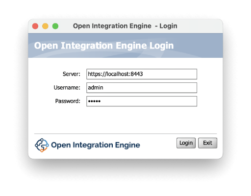
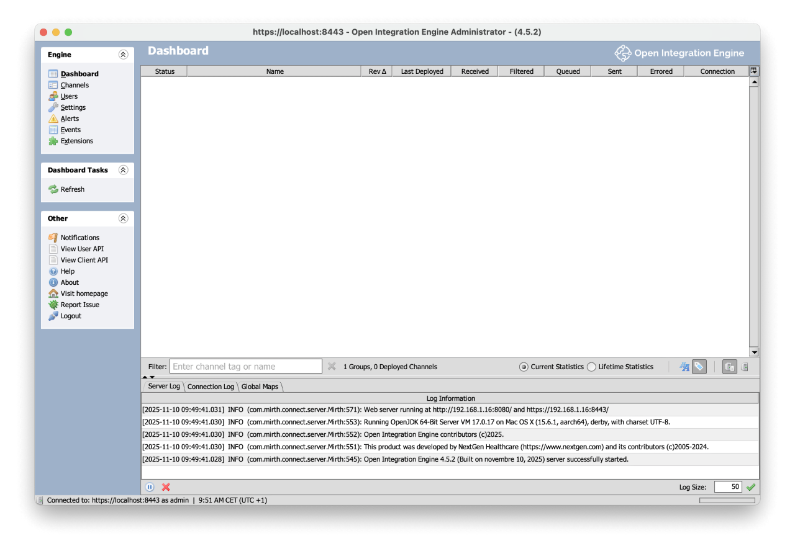
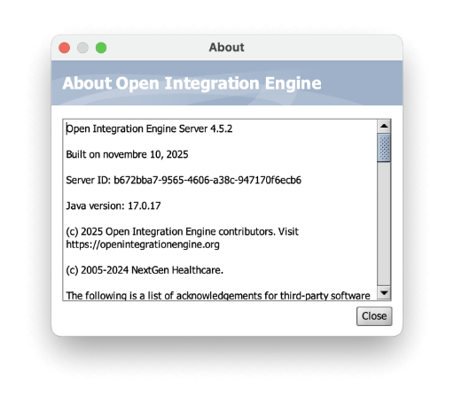

# Contributing to Open Integration Engine

Thank you for your interest in contributing to the **Open Integration Engine** project. Contributions are vital to the continued growth and success of the project, and we welcome all forms of participation, whether you are a developer, a documentation contributor, or a user providing feedback.

The contribution process is straightforward and can be completed in a few simple steps:

## How to Contribute

### 1. Open an Issue
Before making any changes, please open an issue in the [GitHub Issues Tracker](https://github.com/OpenIntegrationEngine/engine/issues). This step helps us discuss the problem or feature before work begins, ensuring alignment and reducing redundant efforts.

### 2. Fork the Repository
Start by forking the [Open Integration Engine GitHub repository](https://github.com/OpenIntegrationEngine/engine) to your own GitHub account.

### 3. Clone Your Fork
Clone your fork locally to your development environment:
```bash
git clone git@github.com:OpenIntegrationEngine/engine.git
```

### 4. Make Changes
Create a new branch for your feature or bug fix:
```bash
git checkout -b feature/your-feature-name
```

### 5. Install Tooling

#### Java Version Requirements

The current Open Integration Engine has different Java version requirements for **build time** and **runtime**:

- **Build SDK**: Java 8 (to maintain compatibility with the current codebase)
- **Runtime**: Java 17 or higher (required for server and client execution)

#### Install Java Versions with SDKMAN

Install [SDKMAN](https://sdkman.io/) and use it to manage both Java versions:

```bash
# Install SDKMAN (if not already installed)
curl -s "https://get.sdkman.io" | bash
source "$HOME/.sdkman/candidates/java/current/bin/java"

# Install Java 8 for building
sdk install java 8.0.442.fx-zulu

# Install Java 17 with JavaFX for runtime (required for client GUI)
sdk install java 17.0.17.fx-zulu

# Install Apache Ant
sdk install ant 1.10.14
```

**Set build-time Java:**
```bash
sdk use java 8.0.442.fx-zulu
```

**Verify versions:**
```bash
java -version  # Should show Java 8
ant -version   # Should show Ant 1.10.14
```

> **Important:** After building with Java 8, you'll need Java 17+ with JavaFX (`17.0.17.fx-zulu` or higher) to run the server and client. The runtime Java is specified in `conf/custom.vmoptions` for the server and `oieclient.vmoptions` for the client.

### 6. How To Build

The project uses **Apache Ant** as the build system. All build orchestration is managed from the `server` directory.

#### 6.1 Build Commands

**Full Build (Development)**
```bash
cd server
ant -f mirth-build.xml -DdisableSigning=true
```

> **Note:** This build takes approximately 2 minutes 20 seconds on a MacBook Pro M4 Pro.

This will:
- Build Donkey (message processing engine)
- Build Server extensions
- Build Client
- Build Manager
- Build CLI (Command Line Interface)
- Run all tests
- Create the complete setup in `server/setup/`

**Fast Build (Skip Tests)**
```bash
cd server
ant -f mirth-build.xml -DdisableSigning=true -DdisableTests=true
```

> **Note:** This build takes approximately 10-11 seconds on a MacBook Pro M4 Pro.

Use this for faster builds during development when you don't need to run the full test suite.

**Full Build (Signed - for releases)**
```bash
cd server
ant -f mirth-build.xml
```

**Create Distribution Package**
```bash
cd server
ant -f mirth-build.xml dist
```

### 7. How To Run

After building, the complete application is available in `server/setup/`.

#### Running the Server

The server is the core integration engine that processes messages and manages channels:

```bash
cd server/setup
./oieserver
```

You should see output similar to this:

```bash
Info: Found suitable java version specified by the -java-cmd directive in '/Users/michel/Developer/misc/engine/server/setup/conf/custom.vmoptions'
Starting Open Integration Engine...
INFO  2025-11-10 09:49:41.028 [Main Server Thread] com.mirth.connect.server.Mirth: Open Integration Engine 4.5.2 (Built on novembre 10, 2025) server successfully started.
INFO  2025-11-10 09:49:41.030 [Main Server Thread] com.mirth.connect.server.Mirth: This product was developed by NextGen Healthcare (https://www.nextgen.com) and its contributors (c)2005-2024.
INFO  2025-11-10 09:49:41.030 [Main Server Thread] com.mirth.connect.server.Mirth: Open Integration Engine contributors (c)2025.
INFO  2025-11-10 09:49:41.030 [Main Server Thread] com.mirth.connect.server.Mirth: Running OpenJDK 64-Bit Server VM 17.0.17 on Mac OS X (15.6.1, aarch64), derby, with charset UTF-8.
INFO  2025-11-10 09:49:41.031 [Main Server Thread] com.mirth.connect.server.Mirth: Web server running at http://192.168.1.16:8080/ and https://192.168.1.16:8443/
```

By default, the server requires Java 17 or higher. The runtime is configured via `conf/custom.vmoptions`.

**Server VM Options:**
- `oieserver.vmoptions` - Main configuration file (includes other files)
- `conf/base_includes.vmoptions` - Base JVM settings
- `conf/default_modules.vmoptions` - Java 9+ module exports/opens
- `conf/custom.vmoptions` - User customizations (add your `-java-cmd` here)

#### Running the Client

The Administrator client is the GUI for managing the integration engine:

```bash
cd server/setup
./oieclient
```

You should see output similar to this:

```bash
Info: Found suitable java version specified by the -java-cmd directive in '/Users/michel/Developer/misc/engine/server/setup/oieclient.vmoptions'
Starting Open Integration Engine Administrator Client...
```
After loadingm the client, you will see the login screen:


After logging in (default username/password: `admin/admin`), you will see the main dashboard:


You can view the About window from the Help menu:



**Note:** The client was previously launched via Java Web Start (`.jnlp` files), which was deprecated in Java 9 and removed in Java 11. The `oieclient` script replaces this mechanism, avoiding the need for third-party tools like OpenWebStart while providing better control over the Java runtime and JVM options.

The client requires Java 17+ with JavaFX support to run the GUI. The runtime is configured via `oieclient.vmoptions`.

**Client VM Options:**
- `oieclient.vmoptions` - Configuration file (add your `-java-cmd` and JVM options here)

**Note:** Both scripts automatically discover Java in this priority order:
1. `OIE_JAVA_PATH` environment variable (override)
2. `-java-cmd` directive in respective `.vmoptions` file (preferred)
3. `JAVA_HOME` environment variable
4. `java` command in system PATH

#### Packaging

After building, you can create a distribution tarball:

**On Linux (with GNU tar):**
```bash
tar czf openintegrationengine.tar.gz -C server/ setup --transform 's|^setup|openintegrationengine/|'
```

**On macOS (BSD tar - no --transform support):**
```bash
cd server
tar czf ../openintegrationengine.tar.gz setup
```

Or, to rename the directory in the tarball:
```bash
cd server
cp -r setup openintegrationengine
tar czf ../openintegrationengine.tar.gz openintegrationengine
rm -rf openintegrationengine
```

Alternatively, install GNU tar on macOS:
```bash
brew install gnu-tar
gtar czf openintegrationengine.tar.gz -C server/ setup --transform 's|^setup|openintegrationengine/|'
```

#### Build Individual Components

If needed, you can build specific components separately:

```bash
# Build Donkey only
cd donkey
ant build

# Build Server only  
cd server
ant compile

# Build Client only
cd client
ant -f ant-build.xml build

# Build CLI only
cd command
ant build

# Build Manager only
cd manager
ant -f ant-build.xml build
```

#### Build Output

After a successful build, you'll find:
- **`server/setup/`** - Complete application setup ready to run
- **`server/build/`** - Build artifacts
- **`server/dist/`** - Distribution packages (if you ran the `dist` target)

### 8. Implement your changes

Implement the necessary changes, ensuring they align with the project’s coding standards and practices.

### 9. Test Your Changes
Before submitting your changes, please ensure that all tests pass and that your changes work as expected in your local environment.

### 10. Submit a Pull Request
Once your changes are ready, push them to your fork and create a **draft pull request (PR)** from your branch to the `main` branch of the project. Draft PRs help indicate that the work is in progress.  
Mark the PR as **"Ready for review"** only when it is actually complete and ready for feedback. Include a brief description of the changes and reference the related issue.

## Reporting Bugs

If you encounter a bug, please report it using the **GitHub Issues Tracker**:
1. **Search for existing issues** to check if the problem has already been reported.
2. If the issue is not listed, create a new issue with the following information:
   - A clear and descriptive title.
   - Steps to reproduce the issue.
   - The expected vs. actual behavior.
   - Any relevant logs, error messages, or screenshots to help diagnose the issue.

## Suggesting Features

If you would like to suggest a new feature or enhancement:
1. Open a new issue in the **GitHub Issues Tracker**.
2. Label the issue as a **feature request**.
3. Provide a detailed description of the feature and the problem it aims to solve.
4. If applicable, include examples or use cases to demonstrate the value of the feature.

## Community Guidelines

- Be respectful and professional in all interactions.
- Provide constructive feedback and suggestions.
- Engage in discussions around pull requests and issues with an open and collaborative mindset.

## License

By contributing to **Open Integration Engine**, you agree that your contributions will be licensed under the [Mozilla Public License (MPL) 2.0](./LICENSE).

Thank you for your interest in improving **Open Integration Engine**.
